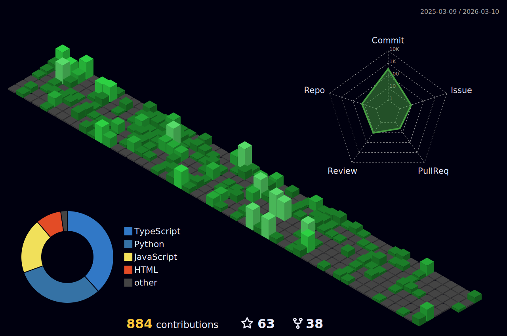

 

<table>
    <tr>
        <th width="1000px" align="center">
            <h1 align="center">Hi 👋, I'm Arpit</h1>
            <h3 align="center">an average cs student with e̶͔͒x̶͔͒í̶̞s̶̮͠ț̸̅e̶̖͐ṋ̷̉t̵͇̾i̵͈̎à̵̩l̴̯̃ ̸̥̋c̸̛̦r̷̲̎ị̵͌s̷̰̾i̷͇̾ś̵̹</h3>
            

                I -
                <ul align="left">
                    <li>am a second year btech sophomore studying cse with spec in aiml.</li> 
                    <li>often spend time studying core concepts of CS.</li>
                    <li>try to expand my skill tree as much as I can.</li>
                    <li>cannot function without a good cup of tea in the morning.</li> 
                    <li>enjoy sketching, beatboxing and being creative.</li>
                </ul>
            

            <h3>Connect with me:</h3>
            

                
                
                
                
                
                
                
            

            <h3>Languages and Tools:</h3>
            
 
                
                
                
                
                
                
                
                
                
                
                 
                
                
                
                
                
                
                
                
                
                 
                
            

        </th>
        <th width="800px">
<!--              -->
            
            
        </th>
    </tr>
</table>
<table>
    <tr>
        <th>
            

        </th>
        <th>
            

        </th>
    </tr>
</table>
 

    

    
