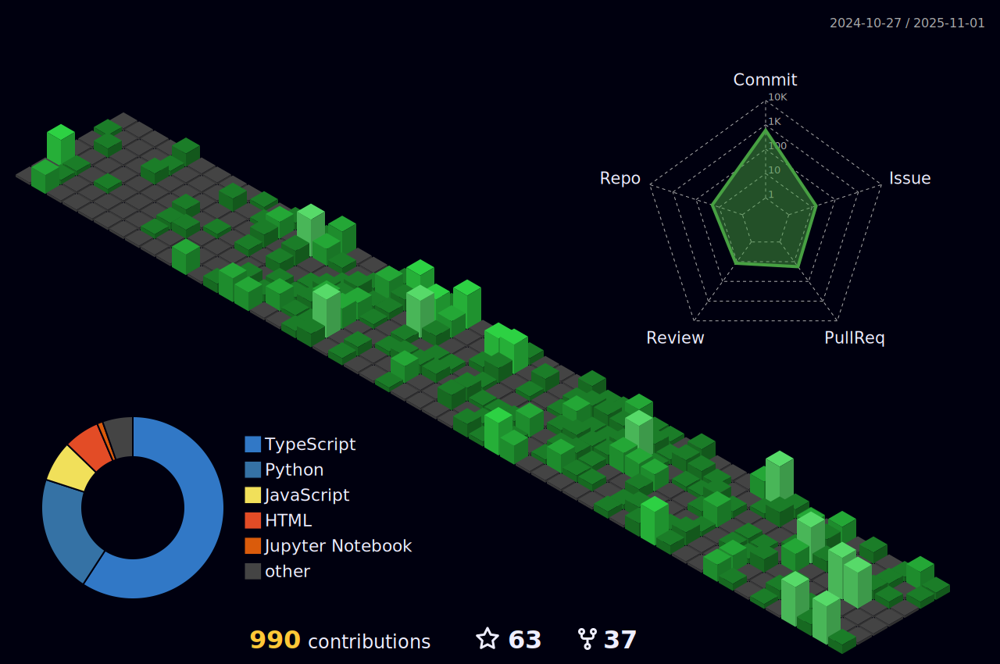

 

<table>
    <tr>
        <th width="1000px" align="center">
            <h1 align="center">Hi 👋, I'm Arpit</h1>
            <h3 align="center">an average cs student figuring out stuff</h3>
            

                <ul align="left">
                    <li>4th year B.Tech student studying CSE with Spec in AIML</li> 
                    <li>often spend time studying core concepts of CS</li>
                    <li>trying to expand my skill tree as much as I can</li>
                    <li>enjoy sketchingX, beatboxing and being creative</li>
                </ul>
            

            <h3>Connect with me:</h3>
            

                
                
                
                
                
                
                
            

<!--             <h3>Languages and Tools:</h3>
            
 
                
                
                
                
                
                
                
                
                
                
                 
                
                
                
                
                
                
                
                
                
                 
                
            
 -->
        </th>
        <th width="800px">
<!--              -->
<!--             <a href="https://spotify-github-profile.kittinanx.com/api/view?uid=314en4ia7eeyco74hvxp6254hmam&redirect=true"> -->
            <a href="https://github.com/arpy8/PastFm" target="_blank">
                
<!--                  -->
            </a>
<!--              -->
        </th>
    </tr>
</table>
<table>
    <tr>
        <th>
            

        </th>
        <th>
            

        </th>
    </tr>
</table>
 

<!-- language and tools -->
<table>
  <tr>
    <td><strong>Frontend</strong></td>
    <td>
      
      
      
      
      
      
      
      
    </td>
  </tr>
  <tr>
    <td><strong>Backend & APIs</strong></td>
    <td>
      
      
      
      
      
    </td>
  </tr>
  <tr>
    <td><strong>Databases</strong></td>
    <td>
      
      
      
      
      
    </td>
  </tr>
  <tr>
    <td><strong>Programming Languages</strong></td>
    <td>
      
      
              
      
<!--       
       -->
    </td>
  </tr>
  <tr>
    <td><strong>AI/ML & Data</strong></td>
    <td>
      
      
      
      
    </td>
  </tr>
  <tr>
    <td><strong>DevOps & Tools</strong></td>
    <td>
      
      
      
      
    </td>
  </tr>
  <tr>
    <td><strong>Design Tools</strong></td>
    <td>
      
      
      
      
      
    </td>
  </tr>
  <tr>
    <td><strong>Others</strong></td>
    <td>
      
      
      
    </td>
  </tr>
</table>
<!-- /language and tools -->

<!-- snake gif -->

    
    

<!-- /snake gif -->

<!-- <table>
    <tr>
        <th></th>
        <th></th>
    </tr>
</table>
 -->
<table>
    <tr>
        <th width="30%">
            

        </th>
        <th width="40%">
            

        </th>
        <th width="30%">
            

        </th>
    </tr>
</table>

    
